# Building an Automated Book Scraper with AI: From Manual Tracking to Production-Ready System

## The Problem

I'm a big fan of the [Acquired podcast](https://www.acquired.fm/) and wanted to read every book they reference. The problem? Manually tracking 200+ books across dozens of episodes, scraping metadata from multiple sources, and keeping cover images reliable was... painful.

## The Solution: One AI-Powered Build Session

I sat down with [Claude Code](https://claude.com/claude-code) and built a production-ready automated scraper in a single session. Here's what we shipped:

- **RSS-based monitoring** that detects new episodes automatically
- **Multi-source metadata** with intelligent fallbacks (OpenLibrary → Amazon scraping)
- **Cloudflare R2 storage** for reliable image hosting (~$0.50/month, 159 covers migrated)
- **Quality controls** with Discord webhooks alerting me to any metadata issues
- **Gap detection** to backfill missed episodes

The result? A fully automated system running as a cron job on Render that keeps [my bookshelf](https://acquired-bookshelf.vercel.app/) up-to-date with zero manual intervention.

## AI as Pair Programmer

What impressed me most wasn't just the speed—it was the **quality of collaboration**. Claude Code acted like a senior engineer who:

1. **Designed the architecture** - Suggested R2 over local storage when I mentioned running on Render (avoiding fragile git commits from cron jobs)
2. **Caught edge cases** - Identified that OpenLibrary was failing for some books, proposed Amazon scraping as fallback #2
3. **Debugged in real-time** - When 5 books came back with "Unknown Author," we immediately built a fix script AND improved the scraper to prevent future occurrences
4. **Added monitoring** - Suggested Discord webhooks proactively so I'd know if anything breaks in production

It wasn't just "write this code" → done. It was iterative problem-solving with context awareness across multiple files and systems.

## Technical Architecture

The system is elegantly simple but robust:

### Episode Discovery
- Monitors Acquired's RSS feed for new episodes
- Adaptive retry logic with 2-hour delays if books aren't available yet
- Classifies episodes (regular vs interviews) to avoid false alarms

### Metadata Pipeline
- Scrapes episode pages for Google Doc "sources" links
- Extracts Amazon book links from Google Docs
- **Three-tier metadata strategy:**
  1. OpenLibrary API (primary - includes subjects, ISBNs)
  2. Amazon page scraping (fallback - extracts title/author from HTML)
  3. Reject with "Unknown" (triggers Discord alert for manual review)

### Storage & Delivery
- Book covers uploaded to Cloudflare R2 (S3-compatible)
- Metadata stored in `books.json` (simple, no database needed)
- Next.js frontend reads from both sources
- R2 serves as CDN for optimized image delivery

### Quality & Monitoring
- Video product filtering (some Amazon links aren't books)
- Discord webhooks report: new books added, unknown metadata alerts, scraper errors
- Backfill system for historical episodes
- Gap detection script to identify missing coverage

## The Stack

- **Frontend**: Next.js 15, Vercel deployment
- **Scraper**: TypeScript, runs on Render as cron job
- **Storage**: Cloudflare R2 (images), JSON file (metadata)
- **APIs**: OpenLibrary, Amazon scraping (cheerio), Discord webhooks
- **Monitoring**: Discord channel with rich embeds

## Key Learnings

1. **AI shines in iterative refinement** - The initial scraper worked, but the AI helped evolve it through real-world edge cases (unknown metadata, video products, missed episodes)

2. **Architecture decisions matter** - Choosing R2 over local storage or Supabase was crucial for a sustainable, low-cost solution

3. **Quality gates are essential** - The Discord alerts for "Unknown" metadata turned out to be critical—caught issues immediately

4. **Don't overthink the data layer** - A JSON file + R2 is perfectly fine for 200 books. No need for Postgres/Supabase unless you need querying/relationships

## The Result

The scraper runs every 2 weeks on Render. When new Acquired episodes drop, it:
1. Detects the episode
2. Finds the Google Doc
3. Extracts Amazon links
4. Fetches metadata (with Amazon fallback if needed)
5. Uploads covers to R2
6. Updates the JSON file
7. Notifies me in Discord with full details

Total cost: **~$0.50/month for R2** + Render free tier.

Check out the live site: [acquired-bookshelf.vercel.app](https://acquired-bookshelf.vercel.app/)

---

## System Architecture

```mermaid
graph LR
    subgraph "Episode Discovery"
        RSS[Acquired RSS Feed]
        CRON[Render Cron Job<br/>Every 2 weeks]
    end

    subgraph "Scraping Layer"
        EP[Episode Page]
        GD[Google Docs<br/>Episode Sources]
        AZ_LINKS[Amazon Book Links]
    end

    subgraph "Metadata Pipeline"
        OL[OpenLibrary API<br/>Primary Source]
        AZ_SCRAPE[Amazon Scraping<br/>Fallback Source]
        FILTER{Video Product<br/>Filter}
    end

    subgraph "Storage Layer"
        R2[Cloudflare R2<br/>Image CDN]
        JSON[books.json<br/>Metadata Store]
    end

    subgraph "Website"
        NEXT[Next.js App<br/>Vercel]
        UI[Book Gallery UI]
    end

    subgraph "Monitoring"
        DISCORD[Discord Webhook<br/>Alerts & Reports]
    end

    %% Episode Discovery Flow
    RSS -->|New episodes| CRON
    CRON -->|Fetch episode page| EP

    %% Scraping Flow
    EP -->|Find Google Doc link| GD
    GD -->|Extract Amazon URLs| AZ_LINKS
    AZ_LINKS -->|Validate URLs| FILTER

    %% Metadata Flow
    FILTER -->|Book URL| OL
    OL -->|Success| R2
    OL -->|Failed| AZ_SCRAPE
    AZ_SCRAPE -->|Success| R2
    AZ_SCRAPE -->|Failed| DISCORD

    %% Storage Flow
    R2 -->|Cover images| JSON
    FILTER -->|Metadata| JSON

    %% Website Flow
    JSON -->|Read data| NEXT
    R2 -->|Load images| NEXT
    NEXT -->|Render| UI

    %% Monitoring Flow
    CRON -->|Success report| DISCORD
    CRON -->|Error alert| DISCORD
    AZ_SCRAPE -->|Unknown metadata| DISCORD

    %% Styling
    classDef discovery fill:#e1f5ff,stroke:#01579b,stroke-width:2px
    classDef scraping fill:#f3e5f5,stroke:#4a148c,stroke-width:2px
    classDef metadata fill:#fff3e0,stroke:#e65100,stroke-width:2px
    classDef storage fill:#e8f5e9,stroke:#1b5e20,stroke-width:2px
    classDef frontend fill:#fce4ec,stroke:#880e4f,stroke-width:2px
    classDef monitor fill:#fff9c4,stroke:#f57f17,stroke-width:2px

    class RSS,CRON discovery
    class EP,GD,AZ_LINKS scraping
    class OL,AZ_SCRAPE,FILTER metadata
    class R2,JSON storage
    class NEXT,UI frontend
    class DISCORD monitor
```

---

## What's Next?

Potential improvements I'm considering:
- Add Goodreads API integration for ratings/reviews
- Build a "mark as read" feature with user authentication
- Add book recommendations based on episode topics
- OCR for books mentioned in podcast transcripts (not in show notes)

But for now? The system just works. And that's the beauty of building with AI—you can focus on the product, not the plumbing.

---

**Tech Stack**: Next.js, TypeScript, Cloudflare R2, OpenLibrary API, Render, Discord
**AI Tool**: Claude Code by Anthropic
**Source**: [GitHub](https://github.com/hurleywgly/acquired-bookshelf)
**Live Site**: [acquired-bookshelf.vercel.app](https://acquired-bookshelf.vercel.app/)
